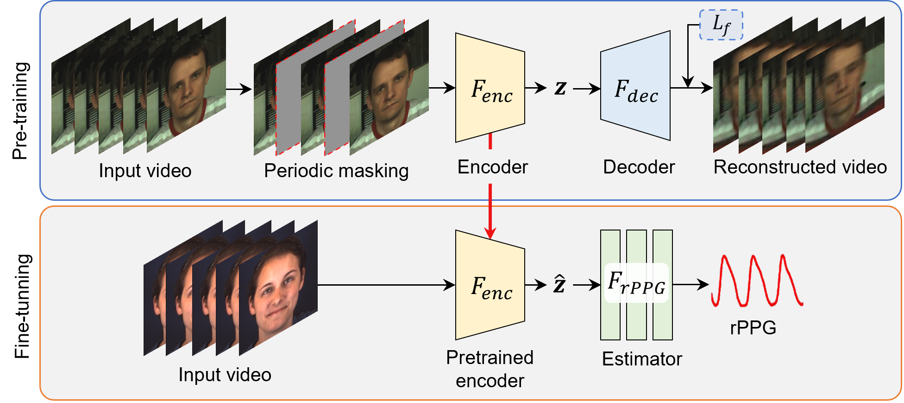

# Periodic-MAE

Periodic-MAE: Periodic Video Masked Autoencoder for rPPG Estimation

<div align="center">
  
</div>

## Setup
Step1: `bash setup.sh` 

Step2: `conda activate PeriodicMAE`

Step3: `pip install -r requirements.txt`

## Example of Using Pre-trained Models
Please find it under `./PreTrainedModels`

## Examples of Periodic-MAE Training
Please use config files under `/configs/train_configs`

## Acknowledgement
We would like to express sincere thanks to the authors of [rPPG-Toolbox, Liu *et al.*, 2023](https://proceedings.neurips.cc/paper_files/paper/2023/hash/d7d0d548a6317407e02230f15ce75817-Abstract-Datasets_and_Benchmarks.html)
For detailed usage related instructions, please refer the GitHub repo of the [rPPG-Toolbox](https://github.com/ubicomplab/rPPG-Toolbox).

```
@article{liu2024rppg,
  title={rppg-toolbox: Deep remote ppg toolbox},
  author={Liu, Xin and Narayanswamy, Girish and Paruchuri, Akshay and Zhang, Xiaoyu and Tang, Jiankai and Zhang, Yuzhe and Sengupta, Roni and Patel, Shwetak and Wang, Yuntao and McDuff, Daniel},
  journal={Advances in Neural Information Processing Systems},
  volume={36},
  year={2024}
}
```

## Citation
If you find our model helpful, please consider citing:

```
@article{choi2025periodic,
  title={Periodic-MAE: Periodic Video Masked Autoencoder for rPPG Estimation},
  author={Choi, Jiho and Lee, Sang Jun},
  journal={arXiv preprint arXiv:2506.21855},
  year={2025}
}
```
